#### rep &check;
noun UK ​ /rep/  
People who sell things.  
a sales rep.

#### cream &check;
noun UK ​ /kriːm/
the thick, **yellowish**-white liquid that **forms** on the top of milk:
strawberries and cream

#### yellowish &check;
adjective UK ​ /ˈjel.əʊ.ɪʃ/
also yellowy, slightly yellow:  
The leaves vary from yellowish-green to dark green.

#### form _on_ &check;
verb UK ​ /fɔːm/  
to make or be something:  
This information formed the **basis** of the report.

#### _the_ basis _of_ &check;
noun UK ​ /ˈbeɪ.sɪs/  
the most important facts, ideas, etc. from which something is developed:  
This document will form the basis for our discussion.  

#### developed _sense_ &check;
adjective UK ​ /dɪˈvel.əpt/
advanced or powerful:  
Sharks have a highly developed **sense** of smell.

#### sense &#128262;
ability  
noun UK ​ /sens/  
an ability to understand, recognize, value, or react to something, especially any of the five physical abilities to see, hear, smell, taste, and feel:  
With her excellent sense of smell, she could tell if you were a smoker from the other side of the room.

#### electric cooker &check;
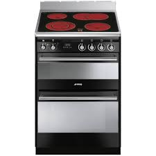

#### armchairs &check;
noun UK ​ /ˈɑːm.tʃeər/  
a comfortable chair with sides that support your arms:  
She sat in an armchair by the fire, reading a newspaper.

#### wardrobe &#128262;
UK ​ /ˈwɔː.drəʊb/  
a tall cupboard in which you hang your clothes:  
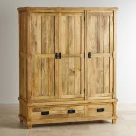  
He hung his suit in the wardrobe.

#### Dust &check;
verb UK ​ /dʌst/  
to use a cloth to remove dust from the surface of something:  
I was dusting the **mantelpiece** when I noticed a crack.

#### mantelpiece &#128262;
noun [ C ] UK ​ /ˈmæn.təl.piːs/  
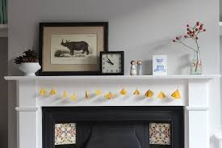  
a shelf above a fireplace, usually part of a frame that surrounds the fireplace:  
She has photographs of all her grandchildren on the mantelpiece.

#### crack &#128262;
noun UK ​ /kræk/   
a very narrow space between parts of something:  
Cracks had appeared in the dry ground.

### grass &check;
noun UK ​ /ɡrɑːs/  
a low, green plant that grows naturally over a lot of the earth's surface, having groups of very thin leaves that grow close together in large numbers:  
a **blade** of grass

#### blade &#128262;
noun UK ​/bleɪd/   
a long, narrow leaf of grass or a similar plant:  
a blade of grass

#### shelf &#128262;
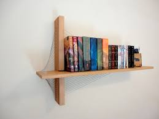  
noun UK ​ /ʃelf/  
a long, flat board fixed horizontally, usually against a wall or inside a cupboard so that objects can be stored on it:  
a glass shelf.

### loaf &check;
noun UK ​ /ləʊf/  
bread that is shaped baked in a single and can be sliced for eating:  
two loaves of white bread.

#### shaped adj.
#### baked adj.
#### sliced adj.

### kettle  &#128262;
noun [ C ] UK ​ /ˈket.əl/   
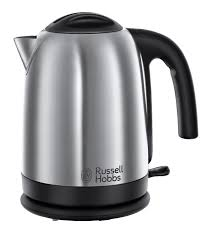  
a container for boiling water, that has **lid**, handle, and **spout** and is made from plastic or metal.

### lid &#128262;
noun [ C ] UK ​ /lɪd/  
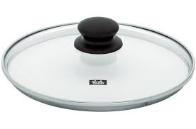  
a cover on an container, that can be **lifted** or removed.  
Can you get the lid off this jar.

### lift &#128262;
verb UK ​ /lɪft/  
to move something from a lower to a higher position.

### spout &#128262;
verb [ I/T ] US ​ /spɑʊt/  
to send out liquid or flames quickly and with force, in a straight line :  
the flames spouted from the oil well.

#### spout noun  &#128262;
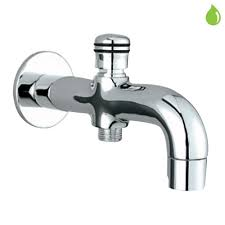  
a tube-shaped opening that allows liquids to be **poured** out of a container

#### pour &#128262;
verb UK ​ /pɔːr/ US ​ /pɔːr/
to make a substance flow from a container, especially into another container, by raising just one side of the container that the substance is in:
I **spilled** the juice while I was pouring it.

#### spill &#128262;
verb UK ​ /spɪl/ US ​ /spɪl/  
to (cause to) flow, move, fall, or **spread** over the edge or outside the limits of something:  
I spilled coffee on my silk shirt.

### flame &#128262;
noun UK ​ /fleɪm/  
a stream of hot, burning gas from something on fire.

### straight
adjective, adverb UK ​ /streɪt/  

### cupboard &check;
noun UK ​ /ˈkʌb.əd/  
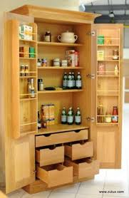  
a piece of furniture or a small part of a room with a door or doors behind which there is space for storing things, usually on **shelves**:  
a kitchen cupboard.

### shelves &check;
noun UK ​ /ʃelvz/
plural of shelf  

### plural
noun UK ​ /ˈplʊə.rəl/

### lamb &#128262;
noun UK ​/læm/  
_a young sheep_ or the flesh of the young sheep eaten as meat:  
lambs **gamboling** about in the fields.

### gambol &#128262;
verb [ I ] UK ​ /ˈɡæm.bəl/  
to run and jump in a happy way:  
lambs were gamboling in the spring sunshine.

### steak &#128262;
noun UK ​ /steɪk/  
a thick, flat piece of meat or fish, especially from a cow:  
T-bone/ sirloin steaks.

### mince &#128262;
noun [ U ] UK ​ /mɪns  
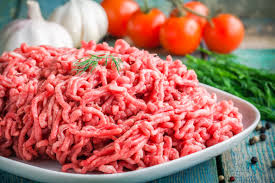  
meat, usually beef, that has been cut up into very small pieces, often using a special machine.  

### climate
noun UK ​ /ˈklaɪ.mət/  
the general wether conditions usually found in a particular place:  
a **harsh** climate.

---

### harsh
adjective UK ​ /hɑːʃ/  
unpleasant, unkind, **cruel**, or more severe than is necessary:  
harsh criticism.

### severe
adjective UK ​ /sɪˈvɪər/  
very serious:  
Severe cutbacks in public spending have been announced.

### cutback  
noun [ C ] UK ​ /ˈkʌt.bæk/  
​a reduction in something, made in order to save money:  
The **closure** of the Manchester printing factory is the company's biggest single cutback so far.

### so far
up to this time.

### closure
noun UK ​ /ˈkləʊ.ʒər/ US ​ /ˈkloʊ.ʒɚ/  
​the fact of a business, organization, etc. stopping operating:  
factory/branch closures  
Many elderly people will be affected by the library closures.

### cruel
adjective UK ​ /ˈkruː.əl/  
extremely unkind, and unpleasant and causing pain to people or animals:  
Don't **tease** him about his weight is cruel.

### tease
verb [ I or T ] UK ​ /tiːz/  
to laugh at someone or say unkind things about them, either because you are joking or because you want to upset that person:  
I used to hate being teased about my red hair when I was at school.

### appointment  
noun UK ​ /əˈpɔɪnt.mənt/  
a formal arrangement to meet or visit someone at a particular time and place:  
I'd like to make an appointment with Dr Evans, please.

### grocer
a person who owns or works in a shop selling food and small things for the home  

### mess
noun UK ​ /mes/  
looks dirty or untidy:  
He makes a terrible mess when he's cooking.

### mechanics
noun [ U ] US ​ /məˈkæn·ɪks/  
a mechanics is someone who job is repair or maintain machines and engines, especially car engines.

### garage
noun UK ​ /ˈɡær.ɑːʒ/  
a building where a car is kept:  
Did you put the car in the garage?

### lamp-post
noun [ C ] UK ​ /ˈlæmp.pəʊst/  
a tall **post** with a light at the side of roads and in other public place:

###  post
noun UK ​ /pəʊst/  
a vertical stick or **pole** stuck into the ground, usually support something or show a position.

### stuck
adjective UK ​ /stʌk/ US ​ /stʌk/  ​
B2 unable to move, or set in a particular position, place, or way of thinking:  
This door seem to be stuck - can you help me push it open?

### pole
noun [ C ] UK ​ /pəʊl/  
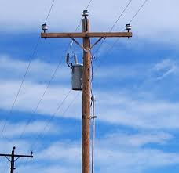  
a long thin stick of wood or metal, often using standing straight  up in the ground to support things:  
a telegraph/electricity pole.

### stick
noun UK ​ /stɪk/  
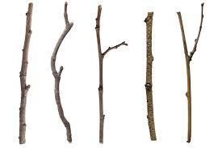  
a thin piece of wood or other material:  
The old man was carrying a **load** of sticks.

### load
noun UK ​ /ləʊd/  
the amount of weight carried, especially by a vehicle, a structure such as a bridge, or an animal:  
The maximum load for this elevator is eight persons.  

### intelligent
adjective UK ​ /ɪnˈtel.ɪ.dʒənt/  
showing **intelligence**, or able to learn and understand things easily:  
a highly intelligent young man.

### intelligence
noun UK ​ /ɪnˈtel.ɪ.dʒəns/  
the ability to learn, understand, and make judgments or have opinions that are based on reason:  
He’s a child of normal intelligence but he’s emotionally **immature**.

### immature
adjective UK ​ /ˌɪm.əˈtʃʊər/   
not yet completely grown or developed:  
While the animals are still immature, they do not **breed**.

### breed
adjective UK ​ /ˌɪm.əˈtʃʊər/  
(of animals) to have sex and produce young animals:  
The blackbird, like most birds, breeds in the spring.

### instalment
noun UK ​ /ɪnˈstɔːl.mənt/  
one of several parts into which a story, plan or amount of money, owed has been divided, so that each parts happens or is paid different times until the end or the total is reached.

### owed [əud]

### dining
dine  
verb [ I ] UK ​ /daɪn/  
to eat them main meal of the day, usually in the evening:  
I hate dining alone.

### counter
noun UK ​ /ˈkaʊn.tər/  
a long, flat, narrow surface or table in a shop, bank, restaurant, etc. at which people are served.  
There was nobody behind the counter when I into the bank, and I had to wait to be served.

### nuisance
noun [ C or U ] UK ​ /ˈnjuː.səns/  
something or someone annoys you or causes trouble for you:  
I've forgotten my umbrella - what a nuisance.

### overtake
verb [ T ] US ​ /ˌoʊ·vərˈteɪk/  
to go beyond something by being a greater amount or degree, or to come from behind and move in front of:  
In the 1500-meter race, he finished with a late rush to overtake Barbosa in 1 minute, 44.84 seconds.

### sensational
adjective UK ​ /senˈseɪ.ʃən.əl/  
very good exciting, or unusual  
a sensational sports car/dress.

### mink
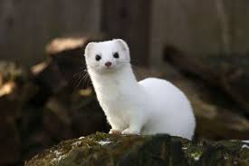  
noun UK ​ /mɪŋk/  
a small animal with valuable fur that is used to make expensive coats. or the fur from this animal:  
a mink coat.  

### compact
adjective UK ​ /kəmˈpækt/  
consisting of parts that are positioned together closely in a tidy way, using very little space:  
compact soil.

### soil
noun UK ​ /sɔɪl/ US ​ /sɔɪl/  
the material on the surface of the ground in which plants grow:
light/heavy/fertile soil

### fertile soil
adjective   
UK ​ /ˈfɜː.taɪl/  
Fertile land can produce a large number of good quality crops.

### litter
noun UK ​ /ˈlɪt.ər/
a small pieces of rubbish that have been left lying on the ground in public places:  
About two percent of fast food packaging ends up as litter.

### prosecute
verb UK ​ /ˈprɒs.ɪ.kjuːt/  
to officially **accuse** someone of committing a crime in a law court, or to try to prove that a person accursed that committing a crime is **guilty** of that crime:  
Shoplifters will prosecuted.

### accurse
verb [ T ] UK ​ /əˈkjuːz/  
to say that someone has done something morally wrong, illegal, or unkind:  
"It wasn't my fault." "Don't worry, I'm not accusing you."

### guilty  
adjective  
responsible for breaking a law:
The jury has to decide whether a person is guilty or innocent of a crime.

### jury  
noun UK ​ /ˈdʒʊə.ri/
​a group of people who have been chosen to listen to all the facts in a trial in a law court and to decide if a person is guilty or not guilty, or if a claim has been proved:  
members of the jury.
