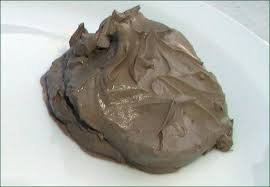

## 查1 小时朗读1 小时。一直朗读到完全吃透解释和例句为止
### puma fur was found clinging to bushes
#### clinging
verb  
Something that is clinging to something else is stuck on it or just attached to it.  
Her glass had bits of orange clinging to the rim.

#### rim
countable noun  
The rim of a container such as a cup or glass is the edge that goes all the way round the top.  
She looked at him over the rim of her glass.

### it left behind it a _trail_ of dead deer and small animals like rabbits.

#### trail (treɪl)
countable noun  
A trail is a series of marks or other signs of movement or other activities left by someone or something.  
Everywhere in the house was a sticky trail of orange juice.  

### The experts were now fully _convinced_ that the animal was a puma.

#### convinced (kənˈvɪns)
adjective  
If you are convinced that something is true, you feel sure that it is true.  
He was convinced that I was part of the problem.  

### this one must have been in the _possession_ of a private collector and somehow _managed_ to escape.

#### possession
uncountable noun  
If you are in possession of something, you have it, because you have **obtained** it or because it belongs to you.  
Those documents are now in the possession of the **Guardian**.  

#### obtain
verb  
To obtain something means to get it or achieve it.  
Evans was trying to obtain a **false** passport and other documents.

#### false
(fɔːls  )   adjective [usually ADJECTIVE noun]  
You use false to describe objects which are artificial but which are intended to look like the real thing or to be used instead of the real thing:      
the items she'd secreted in the false bottom of her suitcase.

#### Guardian (ˈɡɑːdɪən )
countable noun  
The guardian of something is someone who **defends** and protects it.  
The National Party is **lifting** its profile as socially **conservative** guardian of traditional values.

#### lift (lɪft)
verb  
If you lift something, you move it to another position, especially upwards:  
The Colonel lifted the phone and dialed his **superior**. [VERB noun]

#### superior
noun [ C ] UK ​ /suːˈpɪə.ri.ər/ US ​ /səˈpɪr.i.ɚ/  
a person or group of people who are higher in rank or social position than others:  
I will pass your complaint on to my superiors.

#### conservative
adjective UK ​ /kənˈsɜː.və.tɪv/
(AGAINST CHANGE)  
not usually **liking** or trusting change, especially sudden change:  
a conservative society/outlook

#### liking
noun [ S or U ] UK ​ /ˈlaɪ.kɪŋ/  
a feeling that you like someone or something; the fact of liking someone or something:  
She has a liking for fine wines.

#### defend
defend (dɪfend)
verb  
If you defend someone or something, you take action in order to protect them.  
Every man who could fight was now **committed** to defend the **ridge**.

#### commit
verb UK ​ /kəˈmɪt/  
to send someone officially to prison or hospital:  
He's been committed to prison for **fraud**.

#### fraud
noun UK ​ /frɔːd/  
the crime of getting money by **deceiving** people:  
credit card fraud

#### deceive
verb [ T ] UK ​ /dɪˈsiːv/  
​to persuade someone that something false is the truth, or to keep the truth hidden from someone for your own advantage:  
The company deceived customers by selling old computers as new ones.

#### advantage
(ædvɑːntɪdʒ  , -væn-)  
Benefit or profit; gain:  
It is to your advantage to invest wisely.

#### ridge /rɪdʒ/
noun  
a long narrow raised land **formation** with **sloping** sides esp. one formed by the meeting of two faces of a mountain or of a mountain **buttress** or **spur**

#### formation
uncountable noun  
The formation of something is the starting or creation of it.
the formation of a new government.

#### slop
(sloʊp)  
A slope is the side of a mountain, hill, or valley.  
the lower slopes of the Himalayas.

#### buttress
/ˈbʌt.rəs/   
countable noun  
Buttresses are supports, usually made of stone or **brick**, that support a wall.  

#### spur
UK [spɜː(r)]  
an area of high ground that sticks out from a mountain or hill    

#### brick
variable noun  
Bricks are rectangular blocks of baked **clay** used for building walls, which are usually red or brown.Brick is the material made up of these blocks.  
She built bookshelves out of bricks and 
**planks**.  

#### made up
adjective  
**concocted**; falsely **fabricated** or invented:  
a made-up story.

#### fabricate
verb [ T ] UK ​ /ˈfæb.rɪ.keɪt/  
to invent or produce something false in order to deceive someone:  
He was late, so he fabricated an excuse to avoid trouble.  

#### concoct
verb [ T ] UK ​ /kənˈkɒkt/   
to invent an excuse, explanation, or story in order to deceive someone:  
He concocted a story about working late at the office.  

#### clay
variable noun  
Clay is a kind of earth that is soft when it is wet and hard when it is dry. Clay is shaped and baked to make things such as **pots** and bricks.  
the heavy clay soils of **Cambridgeshire**.  

#### Cambridgeshire
Cambridgeshire (ˈkeɪmbrɪdʒˌʃɪə  , -ʃə)

#### pots

#### plank (plæŋk  )
countable noun  
A plank is a long, flat, rectangular piece of wood.
It was very strong, made of three solid planks of wood.

#### flimsy
adjective  
A flimsy object is weak because it is made of a weak material, or is badly made.  
a flimsy wooden door.

#### participle (pɑːʳtɪsɪpəl)
countable noun  
In grammar, a participle is a form of a verb that can be used in **compound** **tenses** of the verb. There are two participles in English:  
the past participle, which usually ends in '-ed', and the present participle, which ends in '-ing'.

#### compound
a word that combines two or more different words.  
Often, the meaning of the compound cannot be discovered by knowing the meaning of the different words that form it. Compounds may be written either as one word or as separate words:  
'Bodyguard' and 'floppy disk' are two examples of compounds.

#### floppy
noun [ C ] UK ​ /ˈflɒp.i/
a diskette (= a flat, circular device, usually inside a square container, that has a **magnetic** covering and is used for storing computer information)

magnetic  
adjective UK ​ /mæɡˈnet.ɪk/  
with the power of a magnet

magnet
noun [ C ] UK ​ /ˈmæɡ.nət/
an object that is able both to attract iron and steel objects and also push them away  

#### diskette
noun [ C ] UK ​ /dɪsˈket/  
a small, flat, square object made of plastic, used in the past to store information electronically  
