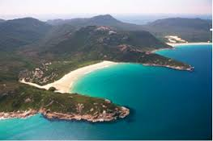

Some time ago, an interesting discovery was made by _archaeologists_ on the **Aegean** island of **Kea**. An American team explored a temple which stands in an ancient city on the **promontory** of Ayia Irini.  

#### archaeologists  
archaeology  
uncountable noun  
Archaeology is the study of the societies and peoples of the past by examining the remains of their buildings, tools, and other objects.  

#### Aegean (iːˈdʒiːən  )
adjective   
of or relating to the Aegean Sea or Islands

#### Kea
in American English (ˈkeɪɑ  ; kāˈä)  
island of the NW Cyclades, Greece, in the Aegean Sea: 50 sq mi (129 sq km)  

#### Cyclades (ˈsɪkləˌdiːz  )  
  
plural noun  
A group of islands of southeast Greece in the southern Aegean Sea.   

#### mi.
abbreviation for  
mile

### promontory 
(prɒməntri  , US -tɔːri  )  
  
plural promontories   
countable noun  
A promontory is a cliff that **stretches** out into the sea.  
...a promontory **jutting** out into the bay.  

#### stretch   
verb (REACH)  
to cause something to reach, often as far as possible, in a particular direction:  
I **tripped** on a piece of wire that someone had stretched across the path.  

#### tripped
trip
verb UK ​ /trɪp/
to lose your balance after **knocking** your foot against something when you are walking or running, or to cause someone to do this:  
He tripped and fell down, **grazing** his knee.

#### grazing
verb
if you graze a part of your body, you injure your skin by **scraping** against something.  
:I had grazed my knees a little.

When animals graze or are grazed, they eat the grass or other plants that are growing in a particular place. You can also say that a field is grazed by animals.

#### scrape (skreɪp)
verb  
If you scrape something from a surface, you remove it, especially by pulling a sharp object over the surface.  
She went round the car scraping the **frost** off the windows.  

if you scrape a apart of your body, you accidentally **rub** it against something hard and rough, and damage it slightly.:  
She **stumbled** and and fell, scraping her palms and knees.

#### rub (rʌb)
verb
1.If you rub a part of your body, you move your hand or fingers backwards and forwards over it while pressing firmly.
He rubbed his arms and **stiff** legs.

2.If you rub against a surface or rub a part of your body against a surface, you move it backwards and forwards while pressing it against the surface.
A cat was rubbing against my leg.

#### stiff 
not easily bent or moved:  
The handle on this door is rather stiff.  

If you are stiff or part of your body is stiff, your muscles hurt when they are moved:  
Sitting still at a computer terminal all day can give you a stiff neck.  
The Mud Bath is particularly recommended for **relieving** **tension** and stiff muscles.

#### stumble (stʌmbəl)
If you stumble, you put your foot down awkwardly while you are working or running.  
He stumbled and almost fell.  

#### relieve (rɪliːv)  
verb  
If something relieves an unpleasant feeling or situation, it makes it less unpleasant or causes it to disappear completely.  
Drugs can relieve much of the pain.

#### tension (tenʃən)
1. Tension is the feeling that is produced in a situation when people are anxious and do not trust each other, and when there is a possibility of sudden violence or conflict.  
The tension between the two countries is likely to remain. [+ between]

2. uncountable noun  
Tension is a feeling of worry and anxiety which makes it difficult for you to relax.
She has done her best to keep calm but finds herself **trembling** with tension and indecision.

#### trembling
(trembəl)  verb  
If you tremble, you shake slightly because you are frightened or cold.  
His mouth became dry, his eyes widened, and he began to tremble all over. [VERB]  

### jut
(dʒʌt) verb  
If something juts out, it sticks out above or beyond a surface.  
The northern end of the island juts out like a long, thin finger into the sea. 

